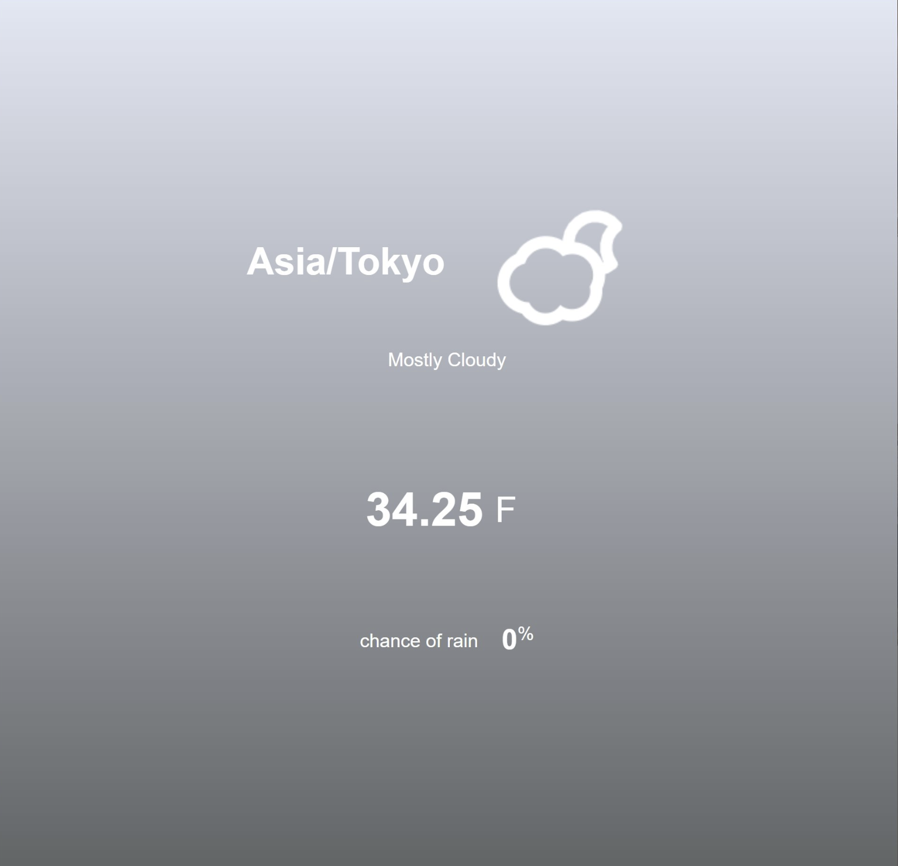
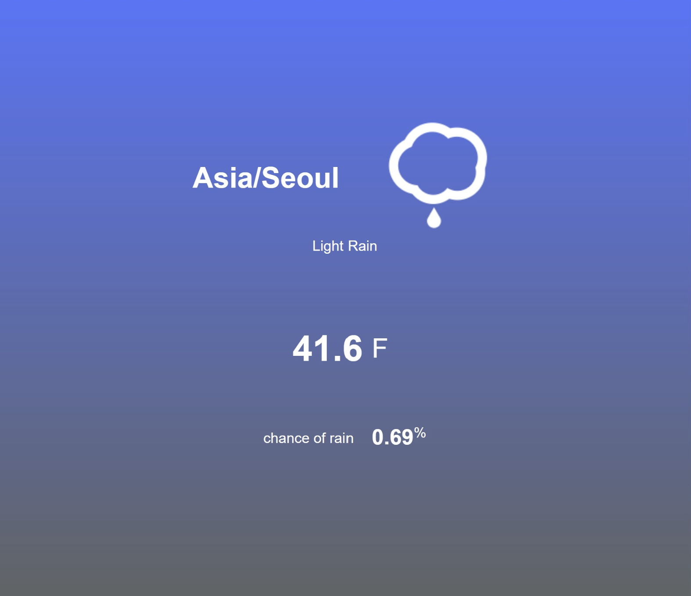
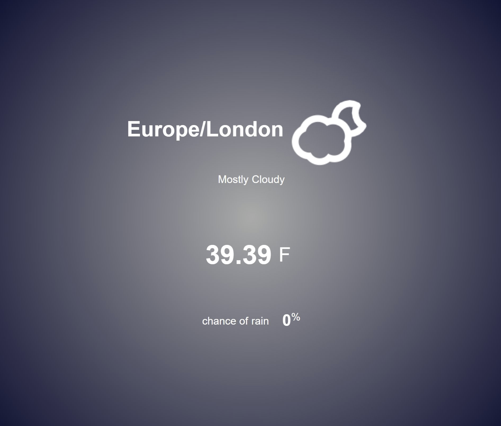
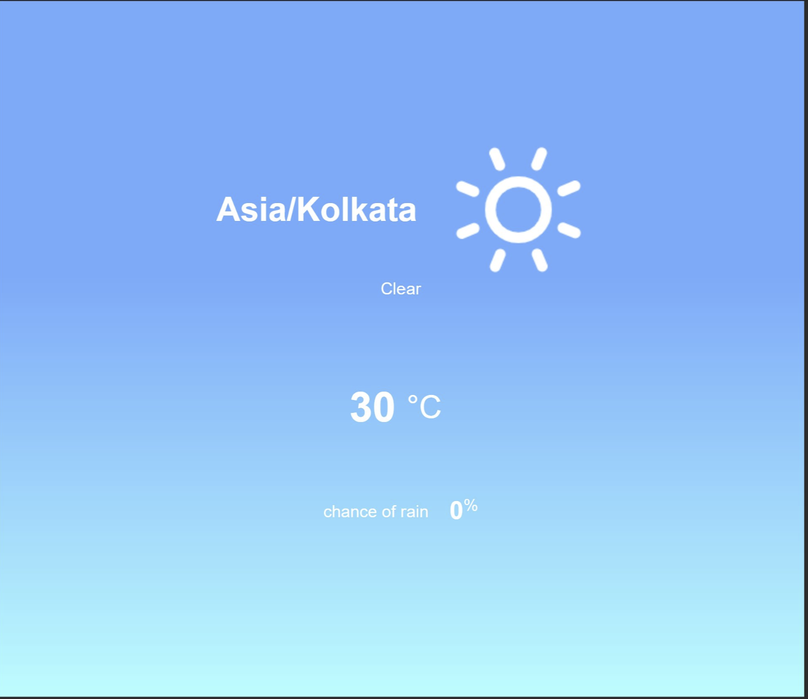

# weather App

## What is this?
- this is an app that shows current weather at the user's location

### what you can get from it?
1. location / time zone
2. current weather from 10 categories (like sunny, cloudy, rainy etc.) with icons
3. temperature with F and C by clicking them, they will switch
4. the percentage of the probability of precipitation
5. background colors changes depending on the weather (10 patterns)

## This project's aim
- fetch API and manipulate it 
- add function that make actions with every different weather

## Technologies
- HTML
- CSS
- javaScript

## Build status

- completed :heavy_check_mark:

## Reference

[Build A Weather App With Vanilla Javascript Tutorial | Javascript For Beginners](https://youtu.be/wPElVpR1rwA)
- a YouTube tutorial that teaches how to create a weather App by Dev Ed

[darksky.net](https://darksky.net/forecast/40.7127,-74.0059/us12/en)
- a website where I get and use API 

[skycons](https://darkskyapp.github.io/skycons/)
- a GitHub repo that let people use a set of ten animated weather glyphs, procedurally generated by JavaScript using the HTML5 canvas tag. 
